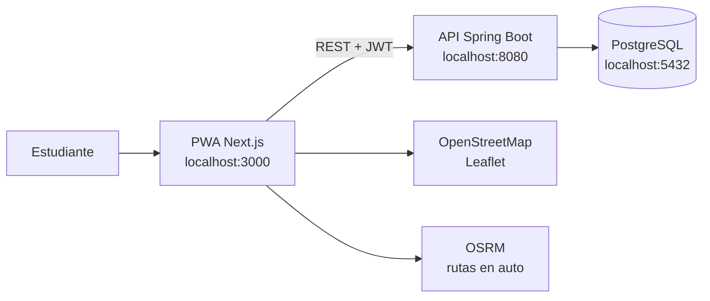
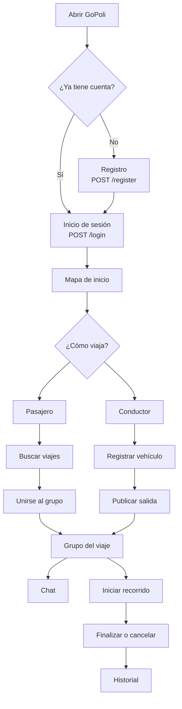
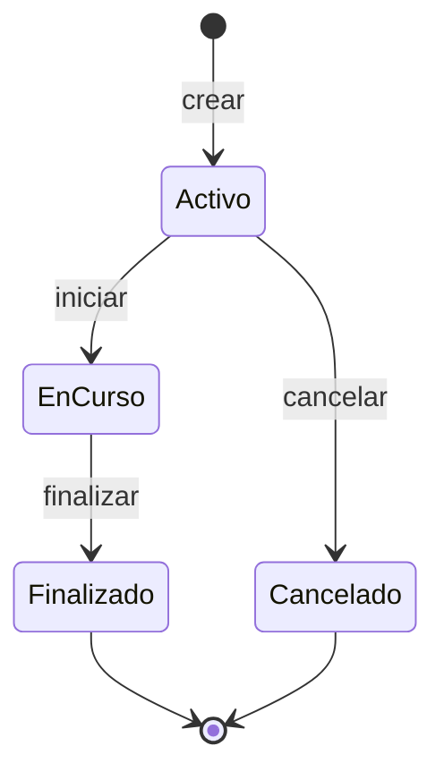
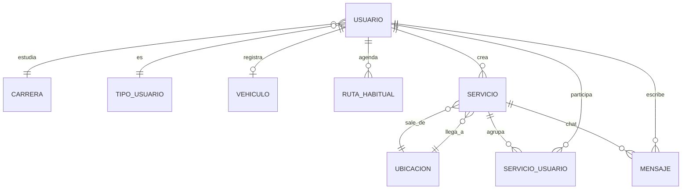

<p align="right">
  <a href="./README_EN.md">
    
  </a>
</p>

<p align="center">
  
</p>

<h1 align="center">GoPoli</h1>

<p align="center">
  Viajes compartidos entre estudiantes.<br/>
  PWA en el celular, API en el servidor, mapa para encontrarse.
</p>

<p align="center">
  
  
  
  
  
  
</p>

---

## Índice

- [Qué es](#qué-es)
- [Cómo está armado](#cómo-está-armado)
- [Recorrido del estudiante](#recorrido-del-estudiante)
- [Ciclo de un viaje](#ciclo-de-un-viaje)
- [Modelo de datos](#modelo-de-datos)
- [Qué puedes hacer](#qué-puedes-hacer)
- [Mapa de pantallas](#mapa-de-pantallas)
- [Tecnologías](#tecnologías)
- [Árbol del repositorio](#árbol-del-repositorio)
- [Mapa de la API](#mapa-de-la-api)
- [Arrancar en local](#arrancar-en-local)
- [Pruebas](#pruebas)
- [Despliegue](#despliegue)
- [Autores](#autores)

---

## Qué es

GoPoli junta estudiantes que van al mismo lugar. Un pasajero busca un cupo. Un conductor publica la salida, la hora y los asientos. El grupo se ve en el mapa, habla por el chat del viaje y cierra el recorrido cuando llega.

La app vive en dos piezas:

| Pieza | Carpeta | Rol |
| --- | --- | --- |
| PWA | `web/` | Pantallas, mapa, sesión en el navegador |
| API | `backend/` | Cuentas, viajes, mensajes, PostgreSQL |

---

## Cómo está armado



La PWA no guarda el token en `localStorage`. El JWT queda en memoria: al recargar la página hay que volver a iniciar sesión. El detalle está en [`web/src/features/auth/SECURITY.md`](web/src/features/auth/SECURITY.md).

---

## Recorrido del estudiante



---

## Ciclo de un viaje

Un viaje (`servicio`) pasa por estos estados. Los números son los de `GoPoliConstants`.



| Estado | Id | Qué significa |
| --- | --- | --- |
| Activo | 1 | Publicado. Todavía se puede unir o salir |
| En curso | 4 | El recorrido ya empezó |
| Finalizado | 3 | Llegaron |
| Cancelado | 2 | Se canceló antes de cerrar |

Hay dos tipos de grupo: viaje de pasajeros (`id 1`) y viaje de conductor (`id 3`). Quien publica es `Creador`; quien entra después es `Miembro`.

---

## Modelo de datos



```text
Usuario
├── Carrera              catálogo académico
├── Tipo                 pasajero (1) o conductor (2)
├── Vehículo             solo si se registra como conductor
├── Rutas habituales     agenda personal
└── Viajes
    ├── Origen y destino (Ubicacion)
    ├── Miembros         ServicioUsuario
    └── Mensajes         chat del grupo
```

---

## Qué puedes hacer

- Crear una cuenta e iniciar sesión con JWT.
- Consultar carreras y ubicaciones del catálogo.
- Publicar un viaje: fecha, hora, origen, destino y cupos.
- Buscar viajes activos, unirte o salir.
- Registrarte como conductor y asociar un vehículo.
- Ver el mapa (OpenStreetMap) y la ruta en auto (OSRM).
- Hablar en el chat del grupo.
- Guardar rutas habituales en la agenda.
- Revisar el historial y editar el perfil, incluida la foto.
- Instalar la PWA en el celular.

---

## Mapa de pantallas

```text
/                          inicio
├── /login                 entrar
├── /registro              crear cuenta
└── zona con sesión
    ├── /mapa              mapa
    ├── /viajes            mis viajes
    ├── /buscar            buscar cupo
    ├── /servicio/nuevo    publicar salida
    ├── /grupo/:id         grupo del viaje
    ├── /agenda            rutas habituales
    ├── /mensajes          bandeja
    ├── /mensajes/:id      hilo
    └── /perfil
        ├── /editar
        ├── /conductor     registro de conductor
        └── /historial
```

En `web/src/features/` cada dominio tiene su vista, su cliente HTTP y sus tipos: `auth`, `mapa`, `viajes`, `servicios`, `grupos`, `agenda`, `mensajes`, `perfil`, `conductor`, `historial`, `catalogo`.

---

## Tecnologías

| Capa | Elección | Versión en el repo |
| --- | --- | --- |
| Interfaz | Next.js, React, TypeScript, Tailwind CSS | Next 16.3.5, React 19.2, Tailwind 4 |
| Mapa | Leaflet + teselas de OpenStreetMap | Leaflet 1.9 |
| Rutas | OSRM (servicio público de ruteo) | — |
| API | Spring Boot, Spring Data JPA, Lombok | Spring Boot 4.0.3, Java 17 |
| Auth | JWT (`jjwt`) y hash de contraseñas | jjwt 0.12.6 |
| Datos | PostgreSQL | 16 (Docker local) o Neon |
| Nube | Railway para la API; la PWA en un host Node | ver despliegue |

---

## Árbol del repositorio

```text
GoPoli/
├── web/                         PWA Next.js
│   ├── src/app/                 rutas del App Router
│   ├── src/features/            dominios de la interfaz
│   ├── public/                  íconos y manifiesto PWA
│   └── .env.example
├── backend/                     API Spring Boot
│   ├── src/main/java/.../       controller, model, repository, security
│   ├── .env.example
│   └── DOCKER_DB.md
├── docker-compose.yml           Postgres local
├── docker/postgres/init/        SQL inicial
├── start-gopoli.bat             arranque en Windows
├── DEPLOY_RAILWAY.md
└── DATABASE_NEON.md
```

---

## Mapa de la API

Base local: `http://localhost:8080`.

```text
API
├── Auth
│   ├── POST /register
│   └── POST /login
├── Catálogo
│   ├── GET  /carreras
│   └── GET  /ubicaciones
├── Perfil  /usuario
│   ├── GET|PUT        /me
│   ├── PUT            /me/foto
│   ├── POST           /me/register-driver
│   ├── POST           /me/unregister-driver
│   ├── GET            /me/historial-viajes
│   ├── POST           /me/inhabilitar
│   └── DELETE         /me
├── Viajes
│   ├── POST           /servicio/crear
│   ├── POST           /servicio/unirse
│   ├── GET            /servicios/activos
│   ├── GET            /servicio/{id}
│   ├── GET            /servicio/{id}/miembros
│   ├── PUT            /servicio/iniciar|finalizar|cancelar/{id}
│   └── DELETE         /servicio/salir/{idServicio}/{idUsuario}
├── Chat
│   ├── GET            /servicio/{id}/mensajes
│   └── POST           /servicio/{id}/mensajes
└── Agenda
    ├── GET|POST       /agenda/rutas
    └── PUT|DELETE     /agenda/rutas/{id}
```

---

## Arrancar en local

Hace falta **Java 17**, **Node.js 20+**, **Docker** (si usas Postgres local) y Maven Wrapper (ya viene en `backend/mvnw`).

### Windows, un solo paso

Doble clic en `start-gopoli.bat`. Levanta Postgres, la API en el puerto 8080 y la PWA en el puerto 3000, y abre el navegador.

### A mano

```bash
git clone https://github.com/MaicolD0930/GoPoli
cd GoPoli

docker compose up -d

cd backend
cp .env.example .env
./mvnw spring-boot:run
```

En otra terminal:

```bash
cd web
cp .env.example .env.local
npm install
npm run dev
```

Abre [http://localhost:3000](http://localhost:3000). La API responde en [http://localhost:8080/ubicaciones](http://localhost:8080/ubicaciones).

En Windows, si `./mvnw` no corre, usa `mvnw.cmd spring-boot:run`.

### Variables

`backend/.env` (Postgres local por defecto):

```env
SPRING_DATASOURCE_URL=jdbc:postgresql://localhost:5432/gopoli
SPRING_DATASOURCE_USERNAME=gopoli
SPRING_DATASOURCE_PASSWORD=gopoli
```

`web/.env.local`:

```env
NEXT_PUBLIC_API_URL=http://localhost:8080
```

Para la base en la nube, sigue [`DATABASE_NEON.md`](DATABASE_NEON.md). Para Docker, [`backend/DOCKER_DB.md`](backend/DOCKER_DB.md).

---

## Pruebas

```bash
cd web && npm test
cd backend && ./mvnw test
```

La PWA cubre validaciones de auth y el armado del payload de perfil. El backend usa los starters de test de Spring Boot.

---

## Despliegue

```text
GitHub
├── Railway          API Spring Boot + variables SPRING_DATASOURCE_*
├── Neon o Railway   PostgreSQL
└── Host Node        PWA con NEXT_PUBLIC_API_URL apuntando a la API pública
```

Guías: [`DEPLOY_RAILWAY.md`](DEPLOY_RAILWAY.md) y [`web/DEPLOYMENT.md`](web/DEPLOYMENT.md).

---

## Autores

- Michael Daniel ([MaicolD0930](https://github.com/MaicolD0930))
- Jorge Martinez (GeorgeAMS)
- Marian Lasney

Proyecto académico. El código de este repositorio se usa con fines educativos.
