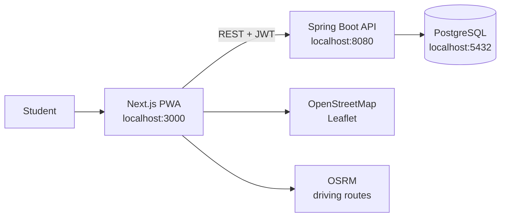
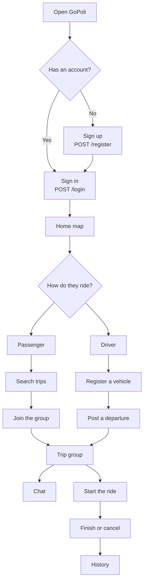
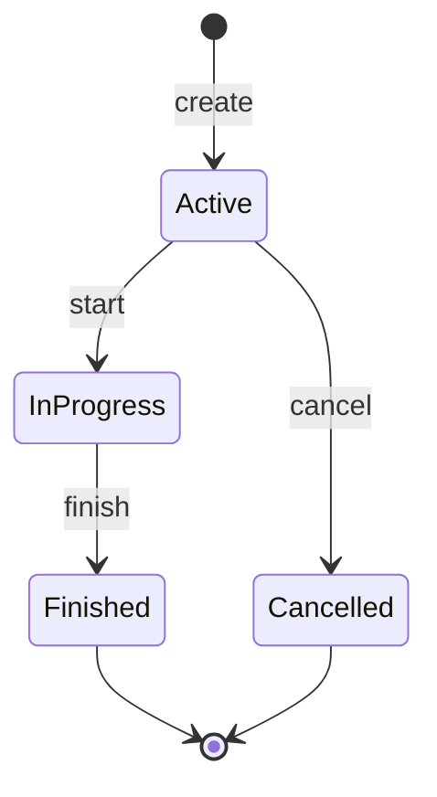
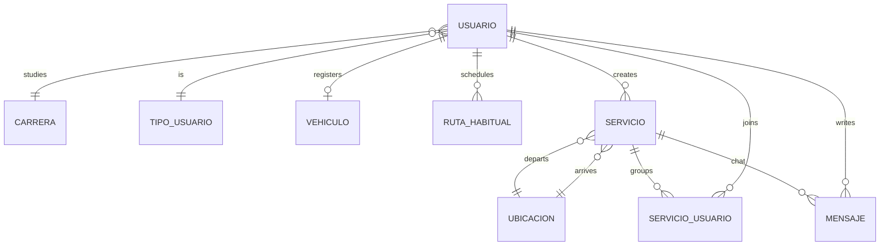

<p align="right">
  <a href="./README.md">
    
  </a>
</p>

<p align="center">
  
</p>

<h1 align="center">GoPoli</h1>

<p align="center">
  Student ride sharing.<br/>
  A phone PWA, a server API, and a map to meet up.
</p>

<p align="center">
  
  
  
  
  
  
</p>

---

## Contents

- [What it is](#what-it-is)
- [How it is built](#how-it-is-built)
- [Student path](#student-path)
- [Trip lifecycle](#trip-lifecycle)
- [Data model](#data-model)
- [What you can do](#what-you-can-do)
- [Screen map](#screen-map)
- [Stack](#stack)
- [Repository tree](#repository-tree)
- [API map](#api-map)
- [Run locally](#run-locally)
- [Tests](#tests)
- [Deploy](#deploy)
- [Authors](#authors)

---

## What it is

GoPoli matches students heading to the same place. A passenger looks for a seat. A driver posts the departure, the time, and the open seats. The group shows up on the map, talks in the trip chat, and closes the ride when they arrive.

The app is two pieces:

| Piece | Folder | Role |
| --- | --- | --- |
| PWA | `web/` | Screens, map, browser session |
| API | `backend/` | Accounts, trips, messages, PostgreSQL |

---

## How it is built



The PWA does not store the token in `localStorage`. The JWT stays in memory, so a full reload asks for login again. Details: [`web/src/features/auth/SECURITY.md`](web/src/features/auth/SECURITY.md).

---

## Student path



---

## Trip lifecycle

A trip (`servicio`) moves through these states. The ids come from `GoPoliConstants`.



| State | Id | Meaning |
| --- | --- | --- |
| Active | 1 | Posted. People can still join or leave |
| In progress | 4 | The ride has started |
| Finished | 3 | They arrived |
| Cancelled | 2 | Cancelled before close |

There are two group kinds: a passenger trip (`id 1`) and a driver trip (`id 3`). The person who posts is `Creador`; anyone who joins later is `Miembro`.

---

## Data model



```text
Usuario
├── Carrera              academic catalog
├── Tipo                 passenger (1) or driver (2)
├── Vehiculo             only after driver registration
├── Rutas habituales     personal schedule
└── Viajes
    ├── Origin and destination (Ubicacion)
    ├── Members          ServicioUsuario
    └── Messages         group chat
```

---

## What you can do

- Create an account and sign in with a JWT.
- Browse careers and locations from the catalog.
- Post a trip: date, time, origin, destination, and seats.
- Search active trips, join, or leave.
- Register as a driver and attach a vehicle.
- See the map (OpenStreetMap) and the driving route (OSRM).
- Talk in the group chat.
- Save usual routes in the agenda.
- Review history and edit the profile, including the photo.
- Install the PWA on a phone.

---

## Screen map

```text
/                          home
├── /login                 sign in
├── /registro              sign up
└── signed-in area
    ├── /mapa              map
    ├── /viajes            my trips
    ├── /buscar            find a seat
    ├── /servicio/nuevo    post a departure
    ├── /grupo/:id         trip group
    ├── /agenda            usual routes
    ├── /mensajes          inbox
    ├── /mensajes/:id      thread
    └── /perfil
        ├── /editar
        ├── /conductor     driver registration
        └── /historial
```

Under `web/src/features/`, each domain owns its view, HTTP client, and types: `auth`, `mapa`, `viajes`, `servicios`, `grupos`, `agenda`, `mensajes`, `perfil`, `conductor`, `historial`, `catalogo`.

---

## Stack

| Layer | Choice | Version in this repo |
| --- | --- | --- |
| UI | Next.js, React, TypeScript, Tailwind CSS | Next 16.3.5, React 19.2, Tailwind 4 |
| Map | Leaflet + OpenStreetMap tiles | Leaflet 1.9 |
| Routes | OSRM (public routing service) | — |
| API | Spring Boot, Spring Data JPA, Lombok | Spring Boot 4.0.3, Java 17 |
| Auth | JWT (`jjwt`) and password hashing | jjwt 0.12.6 |
| Data | PostgreSQL | 16 (local Docker) or Neon |
| Cloud | Railway for the API; the PWA on a Node host | see deploy |

---

## Repository tree

```text
GoPoli/
├── web/                         Next.js PWA
│   ├── src/app/                 App Router routes
│   ├── src/features/            UI domains
│   ├── public/                  icons and PWA manifest
│   └── .env.example
├── backend/                     Spring Boot API
│   ├── src/main/java/.../       controller, model, repository, security
│   ├── .env.example
│   └── DOCKER_DB.md
├── docker-compose.yml           local Postgres
├── docker/postgres/init/        initial SQL
├── start-gopoli.bat             Windows startup
├── DEPLOY_RAILWAY.md
└── DATABASE_NEON.md
```

---

## API map

Local base: `http://localhost:8080`.

```text
API
├── Auth
│   ├── POST /register
│   └── POST /login
├── Catalog
│   ├── GET  /carreras
│   └── GET  /ubicaciones
├── Profile  /usuario
│   ├── GET|PUT        /me
│   ├── PUT            /me/foto
│   ├── POST           /me/register-driver
│   ├── POST           /me/unregister-driver
│   ├── GET            /me/historial-viajes
│   ├── POST           /me/inhabilitar
│   └── DELETE         /me
├── Trips
│   ├── POST           /servicio/crear
│   ├── POST           /servicio/unirse
│   ├── GET            /servicios/activos
│   ├── GET            /servicio/{id}
│   ├── GET            /servicio/{id}/miembros
│   ├── PUT            /servicio/iniciar|finalizar|cancelar/{id}
│   └── DELETE         /servicio/salir/{idServicio}/{idUsuario}
├── Chat
│   ├── GET            /servicio/{id}/mensajes
│   └── POST           /servicio/{id}/mensajes
└── Agenda
    ├── GET|POST       /agenda/rutas
    └── PUT|DELETE     /agenda/rutas/{id}
```

---

## Run locally

You need **Java 17**, **Node.js 20+**, **Docker** (for local Postgres), and the Maven Wrapper already in `backend/mvnw`.

### Windows, one step

Double-click `start-gopoli.bat`. It starts Postgres, the API on port 8080, and the PWA on port 3000, then opens the browser.

### By hand

```bash
git clone https://github.com/MaicolD0930/GoPoli
cd GoPoli

docker compose up -d

cd backend
cp .env.example .env
./mvnw spring-boot:run
```

In another terminal:

```bash
cd web
cp .env.example .env.local
npm install
npm run dev
```

Open [http://localhost:3000](http://localhost:3000). The API answers at [http://localhost:8080/ubicaciones](http://localhost:8080/ubicaciones).

On Windows, if `./mvnw` does not run, use `mvnw.cmd spring-boot:run`.

### Variables

`backend/.env` (local Postgres by default):

```env
SPRING_DATASOURCE_URL=jdbc:postgresql://localhost:5432/gopoli
SPRING_DATASOURCE_USERNAME=gopoli
SPRING_DATASOURCE_PASSWORD=gopoli
```

`web/.env.local`:

```env
NEXT_PUBLIC_API_URL=http://localhost:8080
```

For the cloud database, follow [`DATABASE_NEON.md`](DATABASE_NEON.md). For Docker, [`backend/DOCKER_DB.md`](backend/DOCKER_DB.md).

---

## Tests

```bash
cd web && npm test
cd backend && ./mvnw test
```

The PWA covers auth validations and the profile payload builder. The backend uses the Spring Boot test starters.

---

## Deploy

```text
GitHub
├── Railway          Spring Boot API + SPRING_DATASOURCE_* variables
├── Neon or Railway  PostgreSQL
└── Node host        PWA with NEXT_PUBLIC_API_URL pointing at the public API
```

Guides: [`DEPLOY_RAILWAY.md`](DEPLOY_RAILWAY.md) and [`web/DEPLOYMENT.md`](web/DEPLOYMENT.md).

---

## Authors

- Michael Daniel ([MaicolD0930](https://github.com/MaicolD0930))
- Jorge Martinez (GeorgeAMS)
- Marian Lasney

Academic project. The code in this repository is for educational use.
